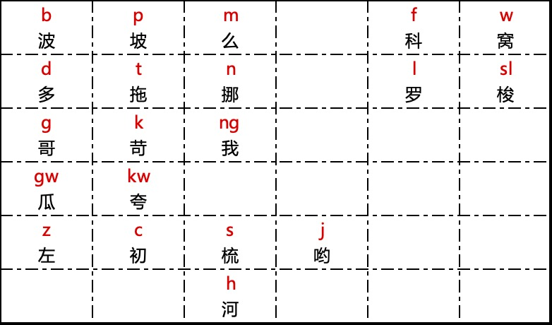
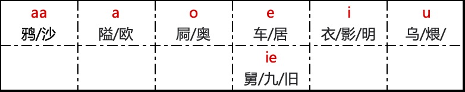
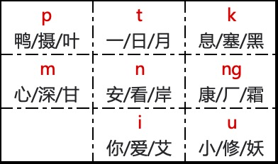
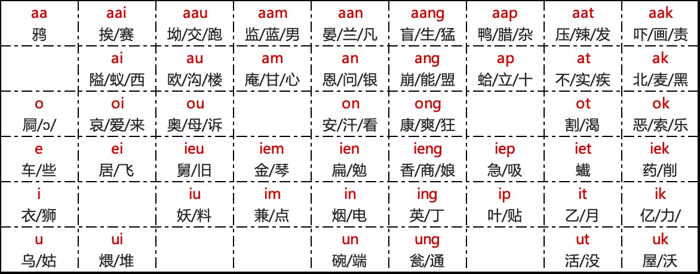
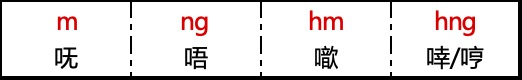
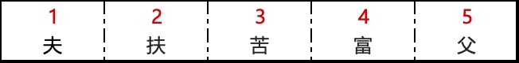

# 03.阳江话拼音的声、韵、调

　　在真正开始打字之前，你还需要学习一下阳江话的拼音。这个章节的目标用最简洁的方式让读者快速掌握阳江话拼音，所以不会涉及音韵学等晦涩艰深的内容。

　　本方案在制作时参考了 [香港语言学学会粤语拼音方案](https://jyutping.org/jyutping/)，所以两个方案有相似之处，有粤语和阳江话基础的前提下，只要花大约 1 个小时就可以一并学会本阳江话拼音方案和 [粤拼](https://lshk.org/jyutping-scheme/)。

## 声母

连同零声母在内，阳江话一共有 21 个声母。

-  声母 **[sl]** 发音为 **[[ɬ](https://zh.wikipedia.org/wiki/清齒齦邊擦音)]** ，但 QWERTY 键盘没有这个键，所以使用 **[sl]** 两个字母键作为它的拼音输入。

-  阳江人发 **[w]** 时唇收拢得不够圆，有点像发 **[v]** 音，但从舌根抬起和从与古音和其他方音比较的角度看，我们不写 **[v]**。同理，**[kw、k'w]** 不标 **[kv、k'v]**，还因无复辅音是汉语的特点。
-  部分零声母开又韵的字音开头有喉塞音 **[ʔ]** ，如“英” **[ʔiŋ]** 、 “益” **[ʔik]** 等，我们将其简化为零声母，不标出来。

## 韵腹

## 韵尾

## 韵母

## 鼻辅音韵母

- 它们不和声母相拼，只做叹词用。

## 声调

声调标在音节后面，如 **fu1（夫）**，**fu2 （扶）**。

