# 04.方案详细说明

## 阳江话

阳江话通行于广东省阳江市江城区、海陵区、阳东县和阳西东部，大致相当于阳江市建市之前的阳东县全部地区。阳江话人又近110万。它南至南海，东边境外有粤话、台山话和恩平话，北边境外有粤语阳春话，西边境内有海话（人口约7万，分布在阳西县儒洞、沙扒、上洋、薄牌等镇），西边偏北有话（人又约7000，分布在阳西县塘又、新圩等镇）。海话和僅话地区也通行阳江话。此外，还有从信宜迁来的粤语信宜话，从贵州等来的少数民族的语音，如瑶语，形成很小的方言岛。阳江县（今阳江市）境内古代居住过越族，汉族迁入后，不同的语音和不同的方言接触频繁，不可避免地互相影响，于是形成很有特色的汉语方言——粤语阳江话。

## 关于方言现状的一点感想

相信很多方言使用者都有“只知其音，不知其字”的体验，日常生活中输入方言的时候遇到这种情况往往用同音字来代替，而且多数人还是用普通话拼音来输入方言，无法做到“我手写我口”。从这个角度来说，大部分方言使用者相对于其使用的方言都是文盲。

为什么会这样？因为我们没有方言教育。国家统一推行普通话教育，在提高全国人民沟通效率上有着巨大的作用，也间接促进了各地区人的融合和经济的发展，这些都是相当巨大的正面作用，但是另一方面也挤压了方言的生存空间，导致上面说的问题。这个现状不限于阳江话，全国所有方言（特别是南方方言）都是如此。

今天的方言现状，个人觉得主要由以下几个因素共同造成：

1. 义务教普及了普通话，奠定了普通话的基础；
2. 改革开放和城市化进程促使一批普通话或强势方言+小众方言的双语人群出现，削弱了方言的生存环境；

3. 移动互联网的兴起，产生了各种购物应用、社交应用、UGC 应用，这些高频使用的应用进一步强化普通话在每个人日常生活中的地位，除了极少数强势方言（例如粤语）之外，绝大部分方言都失去了生存的空间。


在这种情形下，方言的使用场景会随着老一辈人的离开而消亡，没有了使用的需求，方言也不可能再有新的词汇产生，借用生物学的说法，方言已经进入了“功能性灭绝”的状态，彻底灭绝只是时间问题。

历史趋势不可阻挡，制作这个小众的方言输入方案并不能阻止方言的式微，但是在我们还使用方言交流的时候，可以有一种纯粹的、百分百沉浸的、“我手写我心”的体验。

这大概就是这个小众方言输入方案的一点意义所在吧:-)

## 输入法方案

　　阳江话拼音输入法是一个基于 [RIME](https://rime.im) 的拼音输入方案。

### 方言读音来源

　　输入方案最基础的问题是文字的读音来源。不像普通话或者粤语、吴语这类相对的强势的方言，有非常丰富、详实的研究资料，类似阳江话这种小众方言的研究资料非常稀少，在互联网上甚至找不到系统性学习阳江话的网站，只有比较零散和片面的介绍性文章，所以单纯靠个人经验，肯定不可能将常用汉字的方言读音正确标注，而且不同县、镇甚至不同村的人对同一个字的发音都是不同的。另一方面，既然是方言输入方案，那么自然需要有方言词汇输入的能力，靠个人记忆以及人工搜集方言词汇同样不切实际。

　　最终，经过一番查找，发现由当代语言学家黄伯荣著，黄绮仙整理的《广东阳江方言研究》（2018，中山大学出版社）按照汉语言学的体系、框架对阳江话做了比较全面的研究，内容函盖阳江话方言的声韵特点、方言字音、方言词汇、方言语法、方言熟语等多个方面，非常详实。除此之外，黄伯荣先生还著有《现代汉语》教材，在语言学领域具有相当的权威性，故决定参考《广东阳江方言研究》来制作阳江话方言拼音输入方案。

### 方案文件结构

```shell
rime-jienggong-cantonese
├── README.md                               # 说明文档
├── custom_phrase.txt                       # 自定义词组，需要加上编码
├── dicts                                   # 方案词典目录
│   ├── jienggong.admin.dict.yaml           # 阳江市行政区域信息
│   ├── jienggong.chars.dict.yaml           # 单字拼音词典
│   ├── jienggong.idioms.dict.yaml          # 方言熟语词典
│   ├── jienggong.words.dict.yaml           # 方言词汇词典
│   ├── jienggong_manual.chars.dict.yaml    # 根据个人经验注音的单字词典
│   ├── pinyin_simp.patch.dict.yaml         # pinyin_simp 补丁词典
│   └── sogou_words.dict.yaml               # 来自搜狗输入法的词汇，输入方便日常汉语普通话词汇
├── easy_en.custom.yaml                     # 英文输入方案自定义选项
├── easy_en.dict.yaml                       # 英文词典，用于英文单词输入
├── easy_en.schema.yaml                     # 英文输入方案
├── essay-jienggong.txt                     # 八股文，内置一些惯用方言词汇
├── jienggong.dict.yaml                     # 方案词典，实际词汇存放在 dicts 目录
├── jienggong.schema.yaml                   # 方案文件
├── opencc                                  # opencc 目录
│   ├── emoji.chs.json                      # emoji 配置
│   ├── emoji_category.chs.txt              # emoji，在原来基础上转为简体
│   ├── emoji_word.chs.txt                  # emoji，转为简体的同时，增加了方言词汇的 emoji
│   ├── jienggong_dict.json                 # 方言词典配置
│   └── jienggong_dict.txt                  # 对部分方言词汇释义
├── pinyin_simp.custom.yaml                 # 袖珍简体拼音方案自定义选项
├── pinyin_simp.dict.yaml                   # 袖珍简体拼音词典，用于「反查」功能
└── pinyin_simp.schema.yaml                 # 袖珍简体拼音方案
```

### 方案基本功能

#### 声调输入

中文有一个特点就是同音字非常多，这导致拼音输入法都有一个普遍的问题就是重码很多，使得用户无法精确输入目标字词。虽然方言的音节比普通话多，同音字相较普通话来说要更少，但还是避免不了输入时候的重码问题，所以方案在设计的时候加入了声调，在输入低频字词的时候能一定程度上提升输入效率。

阳江话一共有 5 个调值，输入方案对应的调值输入方式如下：

1. `q`: 一声，输入`fuq` 打出 「夫」
2. `r`: 二声，输入`fur`打出「扶」
3. `v`: 三声，输入`fuv`打出「府」
4. `qq`: 四声，输入`fuqq`打出「富」
5. `rr`: 五声，输入`furr`打出「负」

需要注意的是：声调不是必须输入的部分，多数情况下输入声母和韵母就可以得到想要的结果了。

#### 容错、模糊音和简化输入

容错主要针对声母 `j`。阳江话属于粤方言-高阳片，和粤语在多方面有相似性，所以本方案在设计时参考了 [粤拼](https://lshk.org/jyutping-scheme/) ，使用 `j` 作为**「阳」**、**「一」**、**「有」**等字的声母，但是考虑到大家先入为主的习惯了普通话的声母 `y`，所以方案做了 `y` → `j` 的容错，无论输入 **[yat]** 还是 **[jat]** 都可以得到 **「一」**。

模糊音则是针对 **[gw]**、**[kw]** 和 **[sl]**。

- **[gw]**、**[kw]**：有一些地方不区分`瓜`和`家`，都读作`家`；不区分`夸`和`卡`，都读作`卡`  。另一些地方则是年长的人区分，年轻人不加区分，这意味着 **[gw-]** 和 **[kw-]** 正在消失，分别合并到 **[g]** 和 **[k]** 中去了。方案预设了对应的规则来支持这种情形，***但需要用户根据实际情况来开启。***
- **[sl]**：阳江市境内的海话母语人群遇到声母 **[sl]** 的时候都发声母 **[s]** 的音，例如把 **「心」** 读作 **「深」**，本方案也做了兼容，***但需要用户根据实际情况来开启。***
- 简化输入针对的是 **[sl]**，使用 **[x]** 来代替 **[sl]** 能够减少一次击键，这个功能默认开启。

#### 拼音分隔

在不输入声调的情况下，有部分拼音码存在歧义，比如 **[baango]** 存在 **[baan go]** 和 **[baa ngo]** 两种情况，如果输入没有符合预期就使用 单引号 **[']** 来分隔拼音码：

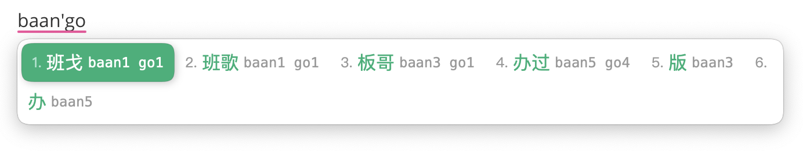

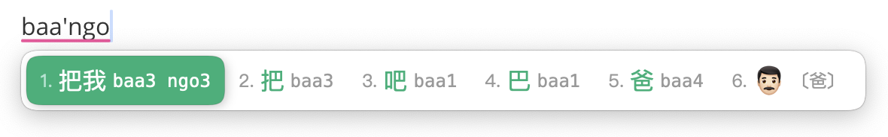

#### 繁体输入

方案默认是简体中文输入，但也支持繁体输入，从选项中切换：

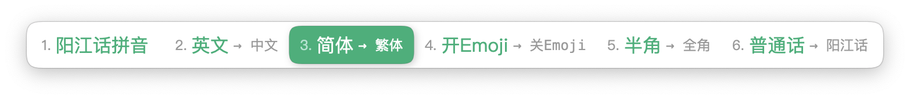

#### Emoji 输入

方案支持 emoji，默认开启，可以通过选项关闭。

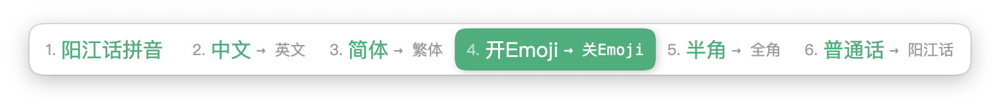

除了默认的 emoji 之外，这个方案还为收录的方言词汇增加了 emoji ，效果如下：

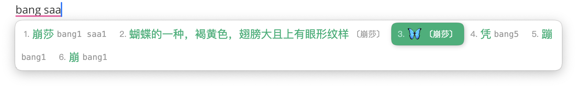

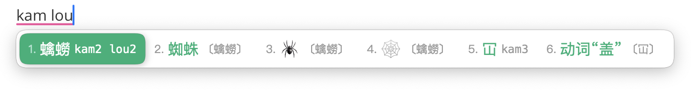

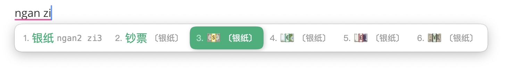

#### 英文输入

虽然是中文方言输入方案，但是也支持中英混输：

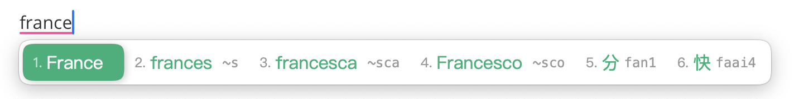

英文输入使用的是 [rime-easy-en](https://github.com/BlindingDark/rime-easy-en) 方案。

#### 反查功能

为了应对不能想起拼音或者不知道某字的阳江话发音的情况，可以使用反查功能来找出相应的阳江话拼音。使用方法是先输入 **[`]** 再输入普通话拼音：

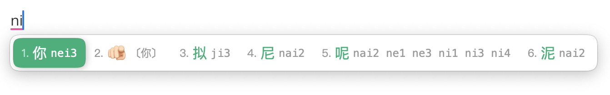

#### 方言词典

任何一种方言都有区别于汉语书面语的词汇，方言用的越少，词汇遗忘的越多，因此有必要为方言词汇增加简单的释义，可以通过选项关闭。


效果如下：


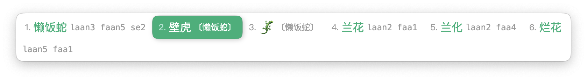

#### 特殊符号输入

通过 `/` 来开启特殊符号的输入。

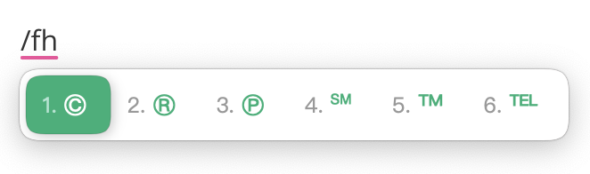

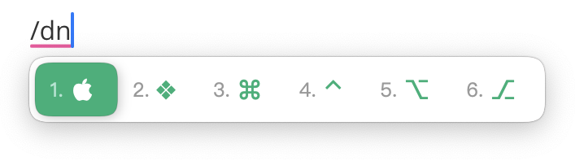

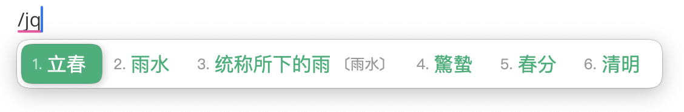

所有符号配置参见文件  `symbols.yaml`。

#### 添加自定义词汇

可以通过两个途径添加自定义词汇：

- **essay-jienggong.txt**： 建议把比较正式的词汇放到这里。可以带编码，也可以不带。格式示例：

  ```yaml
  # 带编码：词汇<Tab>编码<Tab>权重
  蚊虫	man2 cong2	999
  # 不带编码：词汇<Tab>权重
  乜谁	999
  ```

  注意：不带编码的词会使用 `.chars.dict.yaml` 里面的字来编码，如果里面没有相应的字则会忽略。

- **custom_phrase.txt**： 这个词库里面的词不会参与造词（在开启`encode_commit_history`的情况下），不是那么正式的词汇放到这里，主要用来提升输入效率。一定要带编码。格式示例：

  ```yaml
  # 格式：词汇<Tab>编码<Tab>权重
  km/h	sc	999
  km/h	cd	999
  km/h	kmh	999
  ```

添加之后需要重新加载输入法才能生效。

### 方言单字处理

#### 如何收录汉字的方言读音

方案的单字拼音主要收录《广东阳江方言研究》第一章 第六节 同音字汇 和 第七节 字汇 的字音；另外也收录第二章 词汇 的字音。但是在处理的时候遇到了两种情况：

- 一是《广东阳江方言研究》中存在读音和文字，但是既无法从输入法打出来也无法从网上找到的字。这个时候可以借助同样是粤方言但有着丰富研究资料的粤语来寻找相应意思和相似读音的字词，如果存在这样的字词，则使用粤语里的字词来代替。比如《广东阳江方言研究》中意为**「笨，迟钝」**的 **「牛心」（上下结构）** 字就无法找到，但是通过这种方法在粤语里面找到有**「迟钝；不聪敏」**意思的**「吽」**字，那方案就采用这个字。
- 另一种情况是《广东阳江方言研究》中只明确读音和释义，但文字缺失。这个情况同样可用上面的办法来解决。《广东阳江方言研究》里面读音为 **[tʃ'ui43]** 指代**「气味」**的字，通过查找发现是本字是**「馟」**。

如果通过这个办法还是找不出对应的字，那就只能放弃收录了。

到了这一阶段，用我勤劳的双手和简陋的工具一共收录了 6800+ 汉字，已覆盖《现代汉语常用字表》常用字 3500 字。详见 [常用字(2500字)](https://www.zdic.net/zd/zb/cc1/) 和 [次常用字(1000字)](https://www.zdic.net/zd/zb/cc2/)。这部分汉字注音的准确性较高，存放在 `dicts/jienggong.chars.dict.yaml`。

为了覆盖更多的汉字，我又将 [《现代汉语通用字表》(7000字)](https://www.zdic.net/zd/zb/ty/) 未收录的部分汉字导出，然后生成对应的粤拼，再根据一般的 **粤语↔阳江话** 变音习惯以及个人经验来生成阳江话拼音词典，这部分约为 1100+ 个汉字，由于这部分汉字的注音准确性不够高，所与存放在另一个文件 `dicts/jienggong_manual.chars.dict.yaml`。

之后手工详细校验了一遍 `jienggong_manual.chars` 里面的注音，将（修正之后）注音较为准确的大约 240 个汉字调整到了 `dicts/jienggong.chars.dict.yaml`。手工校验、修正注音的效率实在非常之低，整理起来真让人吐血，所以 `jienggong_manual.chars` 这部分汉字的注音暂时就保留现状了。

#### 最终成果

- jienggong.chars：收录 **7034 字，7807 字音**。
- jienggong_manual.chars：收录 **859 字，1350 字音**。

相信这应该能满足绝大部分的日常沟通需求了。（可把我累坏了，叉会腰）

### 方言词汇处理

#### 如何收录方言词汇

方案的方言词汇主要收录《广东阳江方言研究》第二章 词汇 的内容。在处理词汇的时候遇到的情况和收录单字的情况一样，解决方法也一样，这里就不重复了。

#### 输入方案的词汇

《广东阳江方言研究》第二章 词汇 的内容里包含了不少单字，并给出了释义，而作为输入方案的**「词汇」**指的是两字或以上的词汇，因为单字已经被收录到了  `*.chars.dict.yaml` 文件里面了，所以就不重复收录了。

去除单字和找不到本字的词汇，一共收录了 **2456 个方言词汇**，存放在 `dicts/jienggong.words.dict.yaml`。

##### 方言词典的词条

排除找不到本字的词汇，一共收录了 3002 个方言词条，存放在  `opencc/jienggong_dict.txt`。

### 方言熟语处理

个人觉得最能反映方言使用人群文化的是方言熟语、儿歌、歇后语和方言戏曲。考虑到词汇长度，适合输入方案收集的是“熟语”，所以这里收录了 第四章 熟语、儿歌 里面的 熟语，排除找不到本字的熟语，一共收录了 **264 个熟语词条**，存放在 `dicts/jienggong.idioms.dict.yaml`。

熟语相应的释义同样存放在  `opencc/jienggong_dict.txt`。

### 汉语书面语输入

方言输入法除了输入方言词汇之外，还要能够通过方言音来输入汉语书面语，这里使用个人收集的搜狗的词库来实现，约 **115 万词汇**，存放在文件 `dicts/sogou_words.dict.yaml`。

但是这里只收录了约 **7900 个汉字的方言注音**，所以有部分词汇是没有注音的。

### 多音字处理

包含多音字的词汇如果不做处理会影响输入体验。举两个例子：

- 比如想打出 **「机会」**，输入 **[geiwui]** 的时候，**「车会」** 这种并不存在的“词语”也会出现在候选词列表里。
- 另一种情况则是输入不正确的拼音，但是打出存在的词汇，比如想打出 **「词库」**，输入的是 **[ceifu]** ，候选列表里面会出现 **「似乎」**，但它的拼音应该是 **[zeifu]**。

对多音字没有特别好的处理办法，就是筛选出包含多音字的词汇来注音，全靠勤劳的双手完成注音。

### 词频处理

整个输入方案词汇以汉语书面语词频为基础。

阳江话方言里面人称代词、介词、动词非常独特，相较于汉语书面语有较大区别，而高频的词汇恰好也是人称代词、介词、动词，所以给方言词汇赋予它对应的汉语书面语词汇的词频值即可。这是高频词汇的处理办法。

除高频词汇之外，所有方言词汇的词频值默认为 100000。

比较棘手的是多音字的词频，没有特别好的办法，纯粹靠手工处理。

以上处理办法虽然不是很科学，但是效果还不错，能够满足使用需求。

### opencc

opencc 部分主要实现简繁体转换、emoji、方言词典这三个功能。

emoji 部分在原来方案的基础上做了繁体到简体的转换，然后添加了约 **500 个方言 emoji 条目**。

### 输入方案体验

阳江话拼音输入方案在发布之前，本人体验、测试了大约一个月时间。

#### 动态词频、组词、造句

在不开启 `enable_user_dict` 的情况下勉强可以使用，部分字、词不在第一候选，需要手动选词，如果开启 `enable_user_dict` 则可以大大减少手动选词操作。

另一个提升输入体验的选项是开启 `encode_commit_history`，让输入法记录上屏的词句，这样可以补充一些方案里面没有收录到的词句。

开启以上两个选项之后，输入法就有了自动调频、组词和造句的能力，经过一段时间的使用就可以养成你自己的词库了，越用越顺手，输入体验持续提升。

#### 方言词典和 emoji

这两个特性会占用候选列表，如果对你的输入体验造成较大影响可以设置为默认关闭。方法：编辑  `jienggong.schema.yaml`，找到第 31 行和第 36 行，把`1`改为`0`，重新加载输入法生效：

```yaml
 23 switches:
    ……
 29   - name: emoji_suggestion
 30     states: [ 关Emoji, 开Emoji ]
 31     reset: 1
    ……
 34   - name: mandarin_dict
 35     states: [ 阳江话, 普通话 ]
 36     reset: 1
```

### 臣妾做不到的

阳江话在有些情况下需要变调，最典型的就是强调程度的双叠式或三叠式形容词。引用 [阳江话-变调](https://zh.wikipedia.org/wiki/陽江話) 的描述：

```
阳江话使用形容词重叠式（双叠式或三叠式）表达强调程度。形容词重叠式的第一个音节要念成阴去调，发音较长且语气较重；之后的音节不变调，但语气较轻。
```

例子：

- 酸酸 `/ɬun24 ɬun33/`（很酸）；酸酸酸 `/ɬun24 ɬun33 ɬun33/`（很酸很酸、非常酸）
- 阔阔 `/fut̚24 fut̚21/`（很宽）；阔阔阔 `/fut̚24 fut̚21 fut̚21/`（很宽很宽、非常宽）

阳江话里面（应该是全部的）单字形容词都可以用双叠和三叠来强调程度，理论上可以通过穷举来完成注音，但实际上……好像也没有必要……

然后，这是一个输入方案，不具备作为无基础的非阳江话母语人士作为学习阳江话的工具的能力。

### 结语❤️

很高兴阳江话拼音输入方案能够帮助到您。

本项目长期更新，欢迎提 [PR](https://github.com/Lumen01/rime-jienggong-cantonese/pulls) :-)

最后，祝打字愉快 🫶🏻
