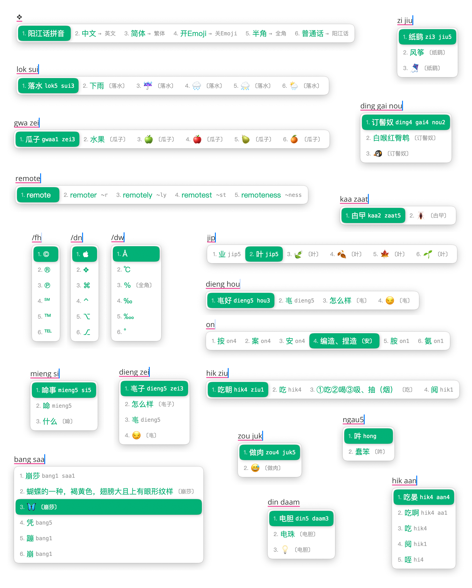

# 00.Rime 阳江话拼音输入方案

我手写我心的方言输入方案🫶🏻

**Step 1：[RIME 输入法安装](01.rime-installation.md)**

　　阳江话拼音输入方案基于 RIME 输入法引擎实现，要使用阳江话拼音打字，首先安装 RIME 输入法。

**Step 2：[阳江话拼音输入方案说明](02.rime-schema.md)**

　　完成输入法的安装之后，再安装 [阳江话拼音输入方案](https://github.com/Lumen01/rime-jienggong-cantonese) ，就可以开始用阳江话拼音打字。

**Step 3： [阳江话拼音方案](03.jienggongwaa-pingjam.md)**

　　先了解这部分拼音的内容，才能流畅的使用阳江话拼音打字。

**参考： [阳江话拼音方案详细介绍](04.rime-jienggongwaa-details.md)** 

　　这个章节分享了 **阳江话方言拼音输入方案** 从设计到实现的全过程，以及遇到的各种问题和困难。

　　看完这个章节之后有助于对本方案做更加详细的配置，比如增加方言字词、调整词频等。
